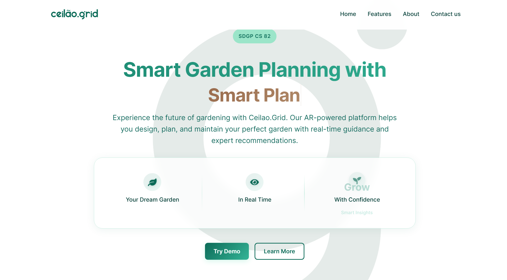

# Ceilao.Grid - Marketing Website

## About

The official marketing website for Ceilao.Grid - an innovative AR-powered mobile application for smart garden planning and management. Developed by IIT undergraduates (SDGP CS 82), this website showcases our app that aims to transform gardening through augmented reality technology.

## App Features Showcased

- **AR-Based Land Analysis**: Scan and measure garden spaces using augmented reality
- **Smart Garden Planning**: Personalized crop and seed suggestions based on garden conditions
- **Weather-Based Insights**: Smart irrigation recommendations and climate data integration
- **Garden Health Monitoring**: Proactive gardening tips and yield predictions

## Marketing Website Tech Stack

- **Framework**: React + Vite
- **Styling**: CSS with custom styling

